## 🌠 Intro

Hello, I'm Sanghwa.

I focus on software architecture, system optimization, and scalable code. \
I aim to create software that solves real problems and provides real value.

## 📊 Stats

<!-- GitHub Readme Stats -->

## 🛠️ Tech Stacks

<!-- Languages -->

  
  

<!-- Frameworks -->

  
  
  
  

<!-- Infra / Devops -->

 
  
  
  
  

<!-- Tools -->

  
  

### 📦 Others

<!-- Languages -->

  
  
  
  

## 🧩 Problem Solving

<!-- solved.ac -->

## 📝 Posts

- [R 프로그래밍 독학 자료 모음](https://blog.naver.com/lnxhigh/221764559893)
